  

  <strong>Умный веб-сервис для совместного планирования путешествий и разделения расходов</strong>

  <a href="#-о-проекте">О проекте</a> •
  <a href="#-ключевые-возможности">Возможности</a> •
  <a href="#-технологический-стек">Стек технологий</a>

  
  
  
  
  
  

  

---

## 📖 О проекте

**TravelSplit** решает главную головную боль любых групповых поездок: хаос в чатах, потерянные чеки, споры «кто кому сколько должен» и забытые билеты. 

Сервис объединяет всё необходимое в одном удобном пространстве: от составления пошагового маршрута и бронирований до алгоритмического расчета взаиморасчетов и сохранения общих фотовоспоминаний.

> 💡 *Путешествуйте с друзьями и делитесь впечатлениями, а не головной болью от подсчёта расходов!*

---

## ✨ Ключевые возможности

| Раздел | Описание |
| :--- | :--- |
| 🗺️ **Маршрут и таймлайн** | Создание поездки, подробный план по дням, фиксация локаций и ключевых точек маршрута. |
| 👥 **Коллаборация** | Приглашение друзей в поездку, совместное редактирование и распределение ролей. |
| 💰 **Умный сплит расходов** | Фиксация трат в любой момент, распределение на всех или выбранных участников, автоматический расчёт минимального количества переводов для закрытия долгов. |
| 🎟️ **Билеты и бронирования** | Единое хранилище авиабилетов, отелей, аренд и входных ваучеров — всё под рукой в офлайн/онлайн доступе. |
| 🎒 **Чек-листы и списки вещей** | Общий список сбора багажа с отметкой, кто что берет (аптечка, палатка, зарядные устройства). |
| 📸 **Общий фотоальбом** | Единое облако фото и видео для всей компании участников путешествия. |

---

## 🛠️ Технологический стек

### **Backend**
- **Язык:** [Java](https://www.java.com/)
- **Фреймворк:** [Spring Boot](https://spring.io/projects/spring-boot) (Spring MVC, Spring Data, Spring Security)
- **Архитектура:** RESTful API

### **Frontend**
- **Библиотека:** [React](https://react.dev/)
- **Скрипты:** JavaScript (ES6+)
- **Окружение:** [Node.js](https://nodejs.org/) & npm
- **Стилизация:** Модульный CSS3 / Flexbox & Grid / Responsive UI

---

  Сделано с ❤️ для путешественников и лёгких поездок

